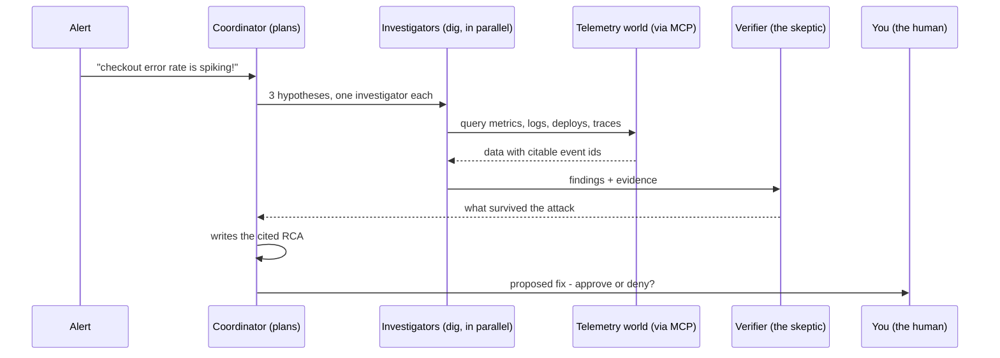
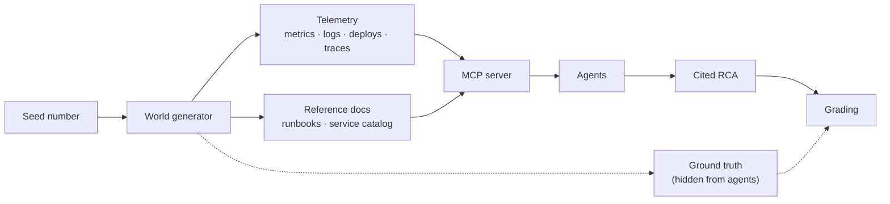

# How Aegis works (the 2-minute version)

Aegis is a team of AI agents that figures out *why* a web system broke - and shows its evidence.

## The problem: something is broken

Big websites aren't one program. They're dozens of small **services** (a checkout service, a
payments service, a database…) constantly calling each other. When one of them misbehaves -
pages slow down, checkouts start failing - that's an **incident**. An alarm (an **alert**) fires,
but the alert points at the *symptom*: the service that screams is rarely the one at fault. A
payments outage might really be a database one hop upstream. Someone has to dig.

## What an RCA is, and why it matters

A **root-cause analysis (RCA)** is the written answer to "what actually broke?": the kind of
failure (e.g. *a bad deploy*), the guilty service, a short explanation - and, crucially, **proof**.
Aegis's RCA cites the exact log lines, metric anomalies, and deploy records that support its
conclusion, plus a confidence score and the hypotheses it ruled out. Without cited evidence, you
fix the wrong thing and the incident comes back at 3 a.m.

## The cast: four roles, one run

An **agent** here is an AI model given a job and a set of tools, run in a loop: look at the
results, decide the next tool call, repeat. Aegis uses four roles:

- **Coordinator** - reads the alert, plans a few *hypotheses* (educated guesses), and writes the final RCA.
- **Investigators** - one per hypothesis, digging through the data *in parallel*.
- **Verifier** - a professional skeptic that attacks each finding before it's believed.
- **You** - any action that would *change* anything pauses the run until a human approves it.

## Where the data comes from

**Telemetry** is the data systems record about themselves: **metrics** (numbers over time, like
error rate), **logs** (text lines), **deploys** (a history of code releases), and **traces** (one
request's journey across services). Aegis's telemetry is **fake, but deterministic**: a generator
builds a 14-service world from a seed number - like a video-game map from a fixed seed - then
secretly injects exactly one fault and records the true answer (the **ground truth**). Ground
truth is hidden from the agents; it exists only to *grade* them afterwards. That's what makes
Aegis measurable instead of just a demo.

Agents read this world through **MCP** (Model Context Protocol - a standard plug that lets an AI
call tools on a server), which also serves reference documents: each service's **runbook** (its
operating manual) and the service catalog.

## How you can see that data

Three windows onto the same world:

- **The dashboard** - watch each agent's lane live: its thinking, every tool call, and the final RCA card.
- **The terminal** - `aegis show <run-id>` replays any finished run: root cause, evidence, per-agent cost.
- **The MCP tools themselves** - `query_metrics`, `query_logs`, `list_deploys`, `sample_traces`,
  `get_dependency_graph`, … Any MCP client can call them and see exactly what the agents saw.

Ready to run it? Setup lives in the [README](../README.md) - the mock mode needs no API key.
